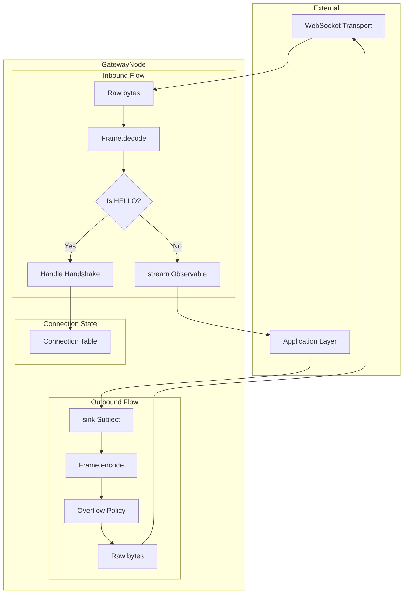
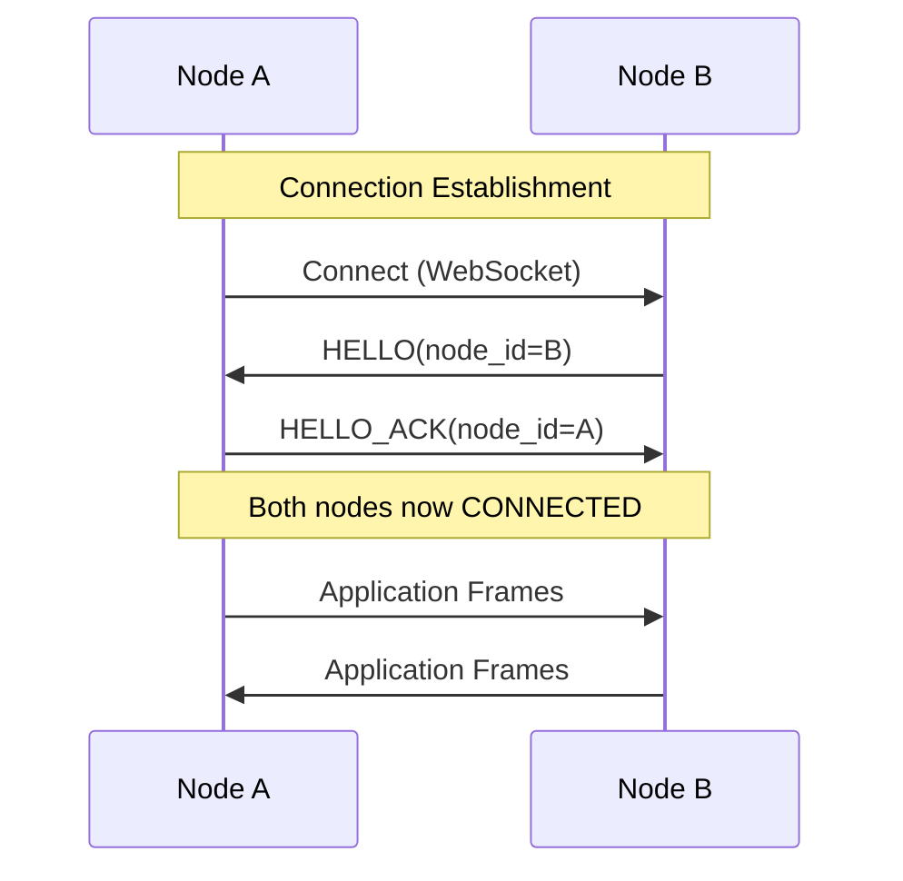

# rxplus.gateway - Reactive Gateway Infrastructure

## Introduction and Design Intention

The `rxplus.gateway` package provides reusable reactive infrastructure for building symmetric peer-to-peer communication gateways. It abstracts common patterns found in bidirectional streaming protocols:

- **Buffer overflow handling**: Various strategies for dealing with slow consumers
- **Stream lifecycle management**: State machine for tracking stream states
- **Connection management**: Connection establishment with handshake protocols
- **Generic framing**: Protocol-agnostic framing abstraction

This package was extracted from dhproto's AICP protocol layer to enable reuse across different reactive streaming applications.

## Package Structure

```
rxplus/gateway/
├── __init__.py       # Public exports
├── overflow.py       # Buffer overflow policies
├── stream.py         # Stream state machine and table
├── connection.py     # Connection state and management
├── framing.py        # Generic framing protocol
└── node.py           # GatewayNode base class
```

## Components

### Overflow Policies (`overflow.py`)

Thread-safe buffer overflow strategies implementing a common `OverflowPolicy[T]` interface.

#### Classes

| Class | Description | Behavior |
|-------|-------------|----------|
| `DropOld` | Ring buffer that drops oldest items | FIFO queue, evicts oldest when full |
| `DropNew` | Buffer that rejects new items when full | Silently drops new items at capacity |
| `BufferK` | Hard limit with disconnect | Raises `DisconnectError` when limit exceeded |
| `Disconnect` | Zero tolerance | Raises `DisconnectError` on first push |

#### Factory Function

```python
def create_overflow_policy(strategy: str, size: int) -> OverflowPolicy[T]:
    """Create an overflow policy from strategy name.
    
    Args:
        strategy: One of 'drop-old', 'drop-new', 'buffer-k', 'disconnect'
        size: Buffer capacity
        
    Returns:
        Configured overflow policy instance
    """
```

### Stream Management (`stream.py`)

State machine for managing stream lifecycles with sequence number tracking.

#### StreamState Enum

```python
class StreamState(Enum):
    INIT = "init"       # Opened but not yet subscribed
    OPEN = "open"       # Opened by initiator
    ACTIVE = "active"   # Both endpoints confirmed
    CLOSED = "closed"   # Stream terminated
```

#### StreamInfo Dataclass

```python
@dataclass
class StreamInfo:
    stream_id: bytes           # 16-byte UUID
    state: StreamState         # Current state
    next_seq: int             # Next expected sequence number
    subscriber: Callable | None  # Optional message handler
    overflow: OverflowStrategy   # Buffer overflow policy
    created_at: float         # Creation timestamp
```

#### StreamTable Class

Thread-safe container for managing multiple streams:

```python
class StreamTable:
    def open(stream_id: bytes, overflow: OverflowStrategy = None) -> StreamInfo
    def subscribe(stream_id: bytes, subscriber: Callable) -> None
    def close(stream_id: bytes) -> None
    def next_seq(stream_id: bytes) -> int
    def validate_seq(stream_id: bytes, seq: int) -> list[int]  # Returns gaps
    def get(stream_id: bytes) -> StreamInfo | None
    def list_streams(state: StreamState = None) -> list[bytes]
    def active_count() -> int
```

### Connection Management (`connection.py`)

Structures for managing connection state and handshake payloads.

#### ConnectionState Enum

```python
class ConnectionState(Enum):
    PENDING = "pending"       # Awaiting HELLO
    HANDSHAKING = "handshaking"  # HELLO sent, awaiting HELLO_ACK
    CONNECTED = "connected"   # Handshake complete
    DISCONNECTED = "disconnected"  # Connection terminated
```

#### Connection Dataclass

```python
@dataclass
class Connection:
    conn_id: bytes           # Raw connection identifier
    state: ConnectionState   # Current state
    remote_node_id: str | None  # Peer's node ID (set after handshake)
    streams: StreamTable     # Per-connection stream table
    overflow: OverflowPolicy[Any]  # Per-connection overflow policy
    created_at: float        # Connection timestamp
```

#### HelloPayload Dataclass

```python
@dataclass
class HelloPayload:
    node_id: str    # Sender's unique node ID
    version: int    # Protocol version
```

### Framing Protocol (`framing.py`)

Protocol class defining the interface for frame encoding/decoding.

```python
@runtime_checkable
class Framing(Protocol):
    """Protocol for encoding/decoding frames."""
    
    def encode(self) -> bytes: ...
    
    @classmethod
    def decode(cls, data: bytes) -> Self: ...
    
    @classmethod
    def create_hello(cls, node_id: str) -> Self: ...
    
    @classmethod
    def create_hello_ack(cls, node_id: str) -> Self: ...
    
    def is_hello(self) -> bool: ...
    
    def is_hello_ack(self) -> bool: ...
    
    def get_hello_node_id(self) -> str | None: ...
```

#### TaggedFrame Generic

```python
@dataclass
class TaggedFrame(Generic[T]):
    """A frame tagged with connection identifier."""
    conn_id: bytes  # Connection identifier
    frame: T        # The frame data
```

### GatewayNode (`node.py`)

Base class for symmetric peer-to-peer gateway nodes.

```python
class GatewayNode(Generic[F: Framing]):
    """Generic gateway node for peer-to-peer communication.
    
    Type Parameters:
        F: Frame type implementing the Framing protocol
    """
    
    def __init__(
        self,
        host: str = "0.0.0.0",
        port: int = 8765,
        node_id: str | None = None,
        overflow_strategy: str = "drop-old",
        overflow_size: int = 1000,
        frame_type: type[F] = None,
    ): ...
    
    # Properties
    @property
    def node_id(self) -> str: ...
    
    @property
    def sink(self) -> rx.Subject[TaggedFrame[F]]: ...
    
    @property
    def stream(self) -> rx.Observable[TaggedFrame[F]]: ...
    
    @property
    def events(self) -> rx.Observable[tuple[str, Any]]: ...
    
    # Lifecycle
    def start(self) -> None: ...
    def stop(self) -> None: ...
    async def connect_to(self, uri: str) -> bytes: ...
    
    # Connection Management
    def get_connection(self, conn_id: bytes) -> Connection | None: ...
    def get_connected_peers(self) -> list[bytes]: ...
```

## Dataflow Graph



## Event Types

The `events` observable emits connection lifecycle events:

| Event | Payload | Description |
|-------|---------|-------------|
| `"connected"` | `(conn_id: bytes, remote_node_id: str)` | Handshake completed |
| `"disconnected"` | `conn_id: bytes` | Connection closed |

## Protocol Sequence



## Logging (OpenTelemetry)

Uses structured logging via `rxplus.telemetry`:

| Log Event | Level | Attributes |
|-----------|-------|------------|
| `GatewayNode started` | INFO | `node_id`, `host:port` |
| `Connection opened` | INFO | `conn_id` |
| `Handshake completed` | INFO | `conn_id`, `remote_node_id` |
| `Connection closed` | INFO | `conn_id` |
| `Frame decode error` | WARNING | `conn_id`, `error` |
| `Overflow disconnect` | WARNING | `conn_id` |

## Usage Example

```python
from rxplus.gateway import GatewayNode, Framing

# Define a custom frame type
class MyFrame:
    def encode(self) -> bytes: ...
    @classmethod
    def decode(cls, data: bytes) -> "MyFrame": ...
    @classmethod
    def create_hello(cls, node_id: str) -> "MyFrame": ...
    @classmethod
    def create_hello_ack(cls, node_id: str) -> "MyFrame": ...
    def is_hello(self) -> bool: ...
    def is_hello_ack(self) -> bool: ...
    def get_hello_node_id(self) -> str | None: ...

# Create and start a gateway node
node = GatewayNode[MyFrame](
    host="0.0.0.0",
    port=8765,
    frame_type=MyFrame,
    overflow_strategy="drop-old",
    overflow_size=1000,
)
node.start()

# Subscribe to incoming frames
node.stream.subscribe(lambda tagged: print(f"Received: {tagged.frame}"))

# Subscribe to connection events
node.events.subscribe(lambda e: print(f"Event: {e}"))

# Send a frame
from rxplus.gateway import TaggedFrame
node.sink.on_next(TaggedFrame(conn_id=..., frame=MyFrame(...)))
```

## Potential Vulnerabilities

1. **Resource exhaustion**: Without proper overflow policies, slow consumers can cause memory exhaustion
2. **Connection state leaks**: Connections must be properly cleaned up on disconnect
3. **Handshake timeout**: No built-in timeout for handshake completion (should be added)
4. **Sequence number overflow**: 32-bit sequence numbers can wrap on very long-lived streams

## Notes

- The `Framing` protocol uses `runtime_checkable` for duck-typing support
- All buffer operations are thread-safe using locks
- WebSocket transport is handled by `rxplus.ws` (RxWSServer, RxWSClient)
- The `GatewayNode` is generic over the frame type, enabling protocol-agnostic usage
